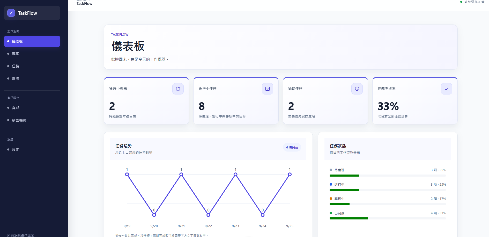
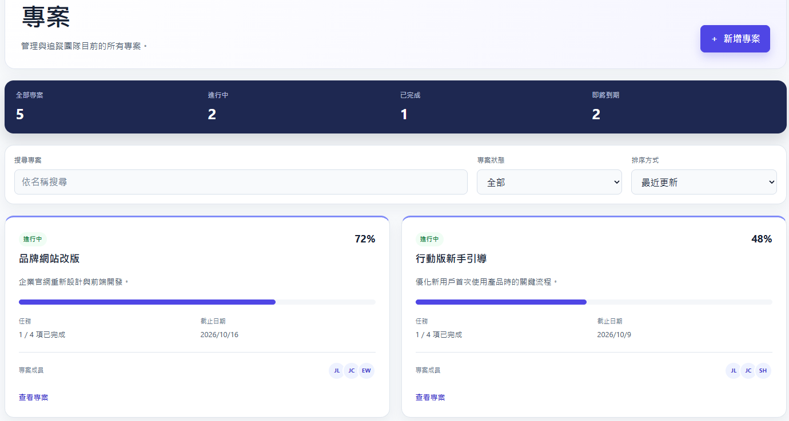
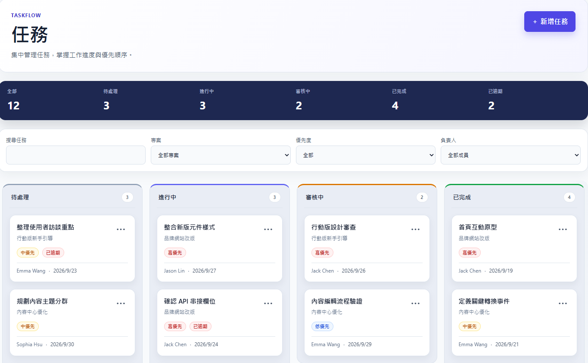
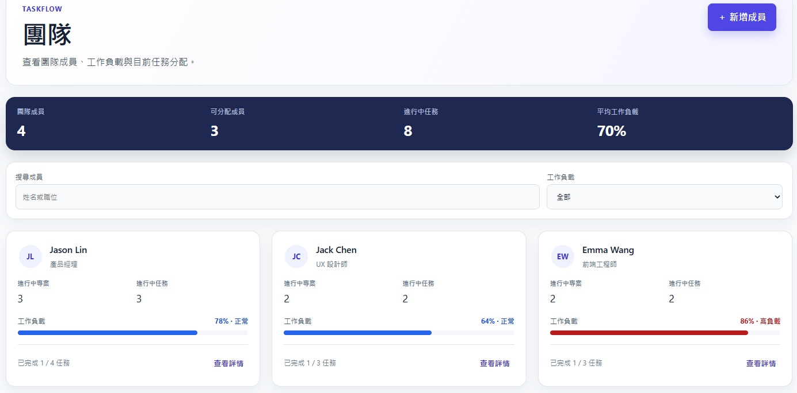
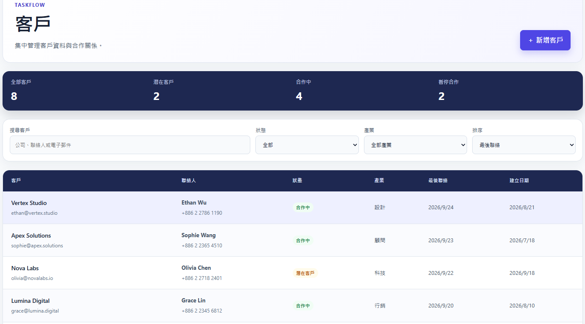
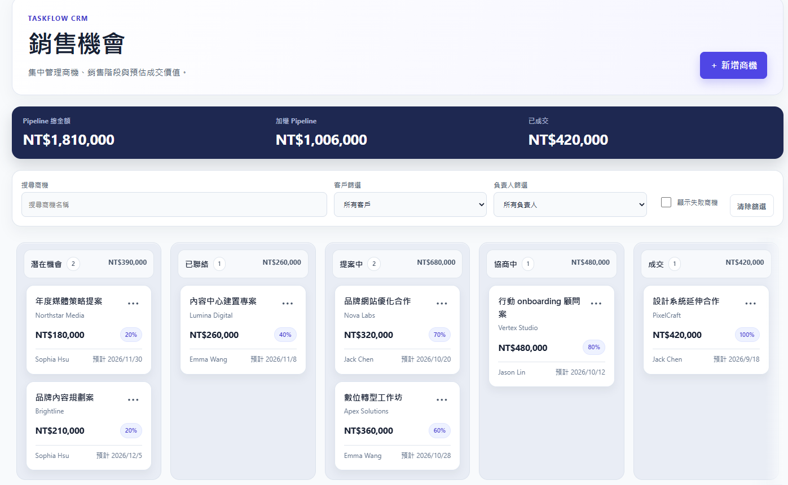

# TaskFlow

Project Management + CRM SaaS 前端作品集專案

🔗 **Live Demo:** https://task-flow-five-peach.vercel.app/  
💻 **GitHub:** https://github.com/qwer070591-arch/TaskFlow

**以 B2B 專案管理與 CRM SaaS Dashboard 為主題的純前端（frontend-only）作品集專案。**

TaskFlow 整合專案、任務、團隊、客戶與銷售機會管理，是一個採用響應式設計的 B2B 工作空間介面。本專案用於展示具實務導向的 Vue 前端架構、狀態管理、無障礙設計模式與測試規劃。

目前所有商務資料皆使用 Mock Data（模擬資料），沒有正式環境的後端（backend）、API 或資料庫服務。

## 專案介紹

TaskFlow 以 B2B 團隊的日常協作情境為設計核心，將專案進度、任務狀態、團隊工作負載、客戶資料與銷售機會集中於同一個 Dashboard。它不是已商業部署的 SaaS 產品，而是用來呈現前端介面設計、資料關聯、互動流程與品質驗證能力的作品集專案。

## 核心功能

- **Dashboard：** 顯示 KPI 卡片、任務完成趨勢與狀態視覺化、專案進度、即將到期工作、近期活動及團隊工作負載摘要。
- **專案管理：** 支援搜尋、篩選、排序與建立專案；可在詳細頁查看專案健康度、日期、進度、關聯任務、成員與活動紀錄。
- **任務管理 / Kanban 看板：** 可依關鍵字、專案、優先度與負責人篩選任務，建立任務，並透過操作選單或原生拖放在「待處理、進行中、審核中、已完成」欄位間更新狀態。
- **團隊管理：** 支援搜尋成員與依工作負載篩選、建立成員，並在詳細抽屜中查看相關專案、進行中及已完成任務。
- **CRM 客戶管理：** 支援搜尋、篩選、排序與建立客戶；桌面版以表格呈現、行動版改用卡片，並可查看客戶聯絡資訊、活動與相關專案。
- **銷售機會：** 可依銷售機會、客戶或負責人篩選銷售管線，建立銷售機會、移動階段，並檢視銷售管線、加權管線、成交與失敗機會摘要。
- **設定：** 可編輯工作空間、個人與通知偏好，還原草稿，並將設定儲存至瀏覽器 `localStorage`。
- **響應式導覽：** 桌面版側邊欄固定顯示且可獨立捲動；在 `1024px` 以下切換為具無障礙設計的導覽抽屜。

## 技術棧

| 領域           | 技術                                         |
| -------------- | -------------------------------------------- |
| 應用程式       | Vue 3、TypeScript、Vite                      |
| 路由與狀態管理 | Vue Router、Pinia                            |
| 單元測試       | Vitest、Vue Test Utils、JSDOM                |
| 端對端測試     | Playwright（Chromium、Firefox、WebKit 專案） |
| 程式碼品質     | ESLint、Oxlint、Prettier                     |

## 專案架構

TaskFlow 使用 Vue Single-File Components，並採用 `<script setup lang="ts">`。

- `src/views` 放置路由層級的頁面元件。
- `src/components` 依功能分類可重用元件，包含 Dashboard、專案、任務、團隊、CRM、設定與版面配置元件。
- Pinia stores 提供專案／任務／團隊成員、客戶、銷售機會、Dashboard 指標及設定的共享狀態與衍生資料。
- `src/types` 定義領域模型；`src/data` 提供 Dashboard、客戶與銷售機會的模擬資料；`src/utils` 放置格式化、驗證與領域輔助函式。
- 專案透過共享 ID 關聯任務、團隊成員與客戶；銷售機會則關聯客戶與負責人。各頁面依這些關聯衍生資料，避免重複維護。

## 路由

| 路由             | 用途                                   |
| ---------------- | -------------------------------------- |
| `/`              | 重新導向至 Dashboard                   |
| `/dashboard`     | 工作空間總覽與營運摘要                 |
| `/projects`      | 專案列表、篩選、排序與建立             |
| `/projects/:id`  | 專案總覽、任務、成員與活動紀錄         |
| `/tasks`         | 可篩選的 Kanban 任務看板               |
| `/team`          | 團隊目錄、工作負載篩選與成員詳細資料   |
| `/customers`     | CRM 客戶列表，支援響應式表格／卡片呈現 |
| `/customers/:id` | 客戶檔案、活動、聯絡資訊與相關專案     |
| `/opportunities` | 銷售管線與失敗銷售機會檢視             |
| `/settings`      | 工作空間、個人與通知偏好設定           |

## 響應式設計

在寬度大於 `1024px` 的畫面，應用程式外殼採用雙欄 Grid。側邊欄使用 sticky 定位、填滿視窗高度，當導覽內容超過視窗時可在側邊欄內部獨立捲動；主要工作區則位於另一個 Grid 欄位。

在 `1024px` 以下，桌面版側邊欄會隱藏，既有的頁首選單按鈕會開啟對話框式導覽抽屜。內容 Grid、表單、資料摘要、客戶呈現方式與操作區域則依各元件的斷點調整。較密集的 Kanban 看板與銷售管線保留內部水平捲動，避免造成整個頁面的水平溢出。

## 無障礙設計

介面已實作並驗證以下無障礙設計細節：

- 使用語意化的 `main`、`nav`、標題、清單、表格與標籤，並提供可直接跳至主要內容的 skip link。
- 提供可見的焦點樣式與具標籤的表單控制項；驗證失敗欄位會設定 `aria-invalid`，錯誤訊息使用 alert 回饋。
- 行動導覽、建立用的 modal 與成員詳細抽屜使用 dialog 語意，支援初始焦點、Tab 焦點管理、Escape 關閉，以及將焦點還原至觸發控制項。
- 狀態回饋使用 live region；任務狀態選單可透過鍵盤操作。
- 啟用 `prefers-reduced-motion: reduce` 時會減少動態轉場。

## 測試與品質

儲存庫已設定以下驗證指令：

```sh
npm run type-check
npm run lint
npm run test:unit -- --run
npm run build
npm run test:e2e
```

單元測試涵蓋 stores、工具函式行為與應用程式外殼。Playwright 端對端測試涵蓋路由導覽、響應式抽屜行為、專案／任務／團隊／客戶／銷售機會流程、設定持久化、行動版版面邊界與銷售管線互動。Playwright 設定包含 Chromium、Firefox 與 WebKit 專案。

## 開始使用

請使用符合 `package.json` 版本範圍的 Node.js（`^22.18.0 || >=24.12.0`）。

```sh
npm install
npm run dev
```

建立正式環境建置：

```sh
npm run build
```

執行單元測試：

```sh
npm run test:unit
```

首次需要時先安裝 Playwright 瀏覽器，再執行端對端測試：

```sh
npx playwright install
npm run test:e2e
```

僅執行 Chromium：

```sh
npm run test:e2e -- --project=chromium
```

## 專案結構

```text
src/
├── components/       # 可重用的功能與版面配置元件
├── data/             # 本機 Dashboard、客戶與銷售機會模擬資料
├── router/           # Vue Router 設定
├── stores/           # Pinia stores 與衍生狀態
├── styles/           # 共用樣式與設計 token
├── types/            # TypeScript 領域模型
├── utils/            # 格式化、驗證與領域輔助函式
├── views/            # 路由層級頁面
├── App.vue
└── main.ts
e2e/                  # Playwright 端對端測試
src/__tests__/        # Vitest 單元測試
```

## Demo 資料與限制

- TaskFlow 為 **純前端（frontend-only）**作品集專案；專案、任務、團隊成員、客戶、活動紀錄、Dashboard 指標與銷售機會皆使用記憶體中的 Mock Data（模擬資料）。
- 沒有正式環境的後端（backend）、API、資料庫、身分驗證服務、付款服務或伺服器端授權機制。
- 大多數商務資料的建立與異動僅存在於目前瀏覽器工作階段，重新整理頁面後不會保留。
- 設定是例外：儲存的設定會透過 `localStorage` 保留在瀏覽器本機。

## 未來規劃

- 將 stores 串接型別明確的後端 API 與持久化資料庫。
- 加入使用者驗證、角色與權限。
- 導入由伺服器支援的活動紀錄、協作功能與更完整的 CRM 報表。

## 專案截圖

### Dashboard

專案與任務的整體工作狀態總覽，包含 KPI、任務趨勢、專案進度、近期活動與團隊工作負載。



### 專案管理

集中管理專案狀態、進度與相關資訊，並支援搜尋、篩選、排序及建立專案。



### 任務管理 / Kanban

以 Kanban 看板管理不同狀態的任務，支援任務篩選、建立、拖放與狀態更新。



### CRM 客戶管理

以桌面表格與響應式介面呈現客戶資料，整合客戶狀態、聯絡資訊與相關專案。



### 銷售機會 / Sales Pipeline

以階段式銷售管線管理商機，呈現 Pipeline、加權金額、成交狀態與客戶／負責人關聯。



### 響應式設計

針對桌面、平板與行動裝置調整導覽與內容配置，行動版使用 Drawer 導覽並維持主要操作流程。



## 作者 / Portfolio

此專案為個人前端作品集專案。
